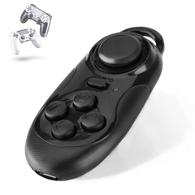

# Musician Gym

**One practice space for ear, voice, and rhythm.**

Musician Gym combines functional ear training, guided vocal warm-ups, and the R3 rhythm-and-coordination trainer in one bilingual, installable app. The tinnitus listening experiment remains available as a separate utility rather than a core training discipline.

## Key Features

**🎧 Auto Mode** - Passive training with automatic cadence playback. Practice while commuting or doing other activities.

**🎮 Remote Control Support** - Use Bluetooth gamepads, cheap USB camera shutters (~$2), or any HID device. Practice hands-free from across the room.

**🎼 Functional Training** - Learn scale degrees in tonal context rather than isolated intervals.

**🎤 Vocal Practice** - Move scales and the six-part DREKXEL-inspired routine through different keys with original pacing and an ascending-descending range.

**🥁 R3 Rhythm Training** - Generate patterns for hands, guitar, or feet with configurable meters, subdivisions, accents, difficulty, count-in, and precise Web Audio scheduling.

**🎹 36 Tonalities & 3 Registers** - Practice every major, natural-minor, and harmonic-minor key in low, middle, or high registers.

**🌙 Dark Theme** - Easy on the eyes for practice in bed or low-light environments.

**⌨️ Custom Key Mapping** - Map scale degrees to any keyboard keys or Bluetooth device buttons for personalized practice.

**📲 Installable & Offline** - Install it as a PWA and keep practicing after the first successful online load.

**📊 Persistent Progress** - Attempts, correct answers, and accuracy remain available between sessions.

## Getting Started

1. **[Open Musician Gym](https://musician-gym.vercel.app/)**
2. Choose Ear, Voice, Rhythm R3, or Tinnitus from the practice rail (the compact menu on mobile).
3. Configure only the musical context needed by that practice.
4. Start training; preferences and recent rhythm patterns remain on the device.

### Custom Controls

**Keyboard Mapping**: Assign scale degrees to any keys (default: home row A-S-D-F-G-H-J-K)

**Bluetooth Controllers**: 
- Piano controllers or keyboards (any HID device)
- Gaming controllers (Xbox, PlayStation, etc.)
- Cheap camera shutters (~$2) 
- Any HID-compatible device

Configure in Settings > Key Mapping. Click "Set key" next to any note, then press your desired key or controller button.

### Auto Mode

Enable in settings for passive practice:
- Adjustable intervals
- Optional audio feedback
- Screen wake lock on supported mobile browsers
- Perfect for background learning

## Training range

Choose any scale or mode in 12 tonal centers and one of three registers. Labels can use fixed solfege (Do–Re–Mi), letter names (C–D–E), or scale degrees (1–2–3), which stay consistent when the key changes. Ear-training rounds can use either piano samples or a synthesized plucked-guitar timbre.

- Major uses an I-IV-V-I cadence.
- Natural minor uses i-iv-v-i and includes the lowered seventh.
- Harmonic minor uses i-iv-V-i and includes the raised seventh.

## Exercises

- **Exercise 1**: Do-Fa - lower tetrachord
- **Exercise 2**: Sol-Do - upper tetrachord
- **Exercise 3**: Full octave Do-Do

## Product structure

- **Ear** — tonal-context recognition with solfege, letters, or scale degrees.
- **Voice** — guided warm-ups across keys and vocal ranges.
- **Rhythm / R3** — pulse, reading, accents, and limb or guitar coordination.
- **Listening tool** — personalized notched audio for tonal tinnitus, clearly separated from the training areas.

## Technical Details

- Built with React + Vite
- Audio engine: Tone.js with piano samples
- Works offline, no data collection
- Mobile optimized

## Development

```bash
git clone https://github.com/MartinAlcalde/musician-gym
cd musician-gym
npm ci
npm run dev
```

Quality checks:

```bash
npm run lint
npm test
npm run build
```

The production workflow runs all three checks before publishing GitHub Pages.

## License

MIT License - see [LICENSE](LICENSE) file for details.
